# Assignment 1 - ReactJS app.

Name: [Yiming Hu]

## Overview.

A film data platform connected to TMDB API that has been independently developed, learned and tested

### Features.

+ Feature 1 Now Playing Movies Page
+ Feature 2 Top Rated Movies Page
+ Feature 3 Movie actors overview and details
+ Feature 4 Similar movies overview and details
+ Feature 5 login and registration platform connect to firebase
+ Feature 6 Current user can view personal details

## Setup requirements.

This project needs the following commands:

npm install firebase
npm install bootstrap
npm install react-bootstrap

## API endpoints.

+ Now Playing Movies - movies/now-playing
+ Top Rated Movies - movies/top-rated
+ Movie actors - movies/credits
+ Similar movies - movies/similar
+ Actor Details - person/:id

## App Design.

### Component catalogue.

Since I added the details page of the movie actors, I created the personDetail and personHeader files in the storybook.

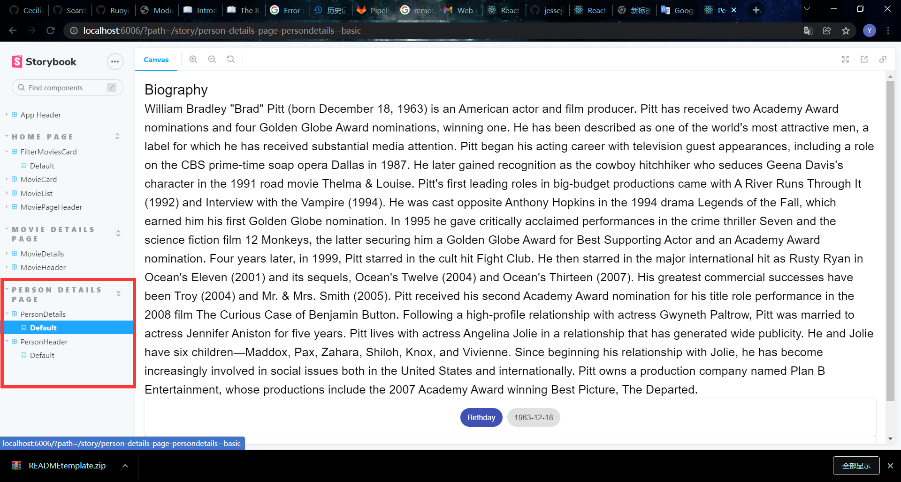

### UI Design.

1.Now playing moview page

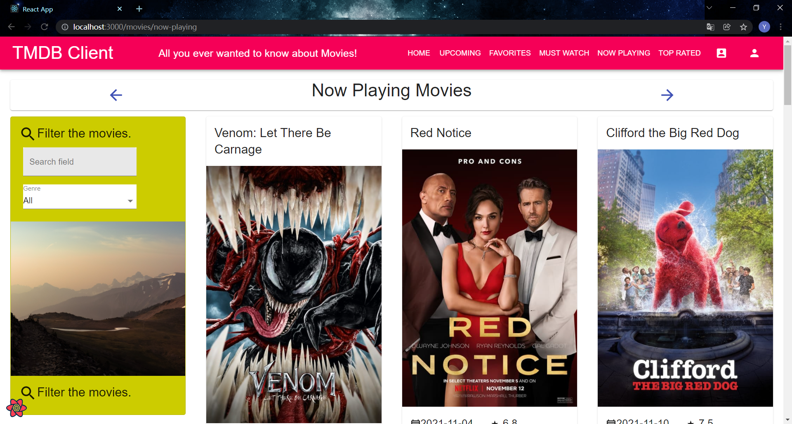

2.Top Rated Movies page

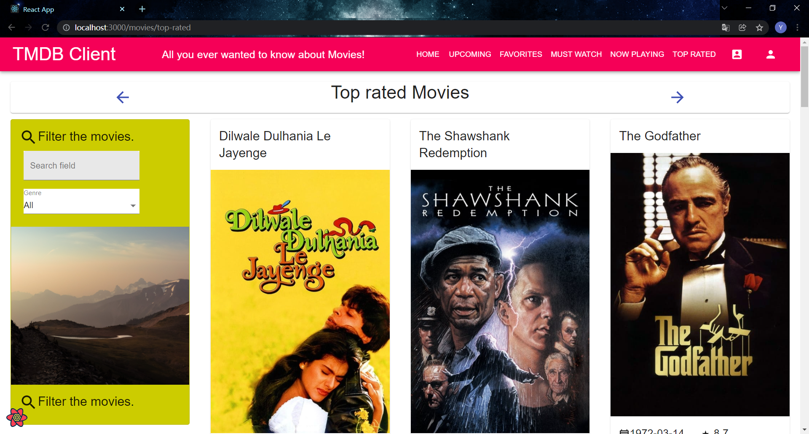

3.login

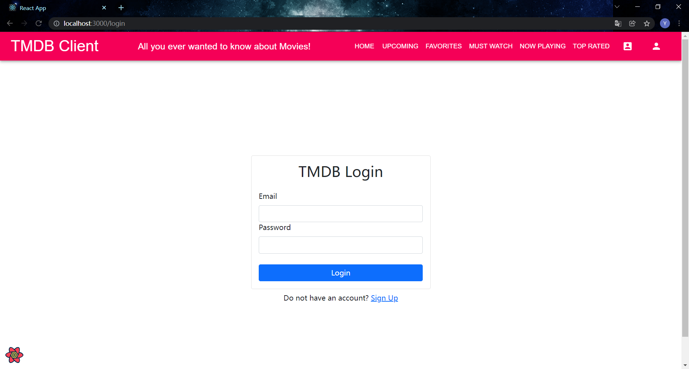

>The user name must be in the form of an email address, and the password must be at least 6 digits. If the user name or password is incorrect, the corresponding error message will be displayed.

4.Signup

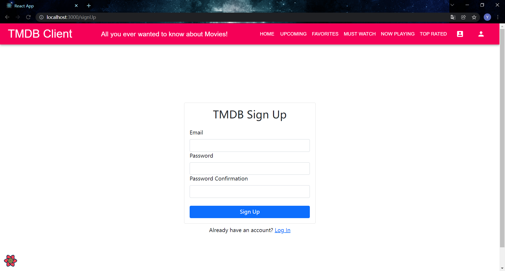

>Visitors can enter the user name in the mailbox format, enter at least six passwords, and confirm the password. If there is a wrong registration operation, the corresponding error message will be fed back.

5.Userfile page

>Visitors cannot watch the number of favorites and mustwatch movies that they have already added. After the user logs in, he can view it, and he can also see his user name at the same time.

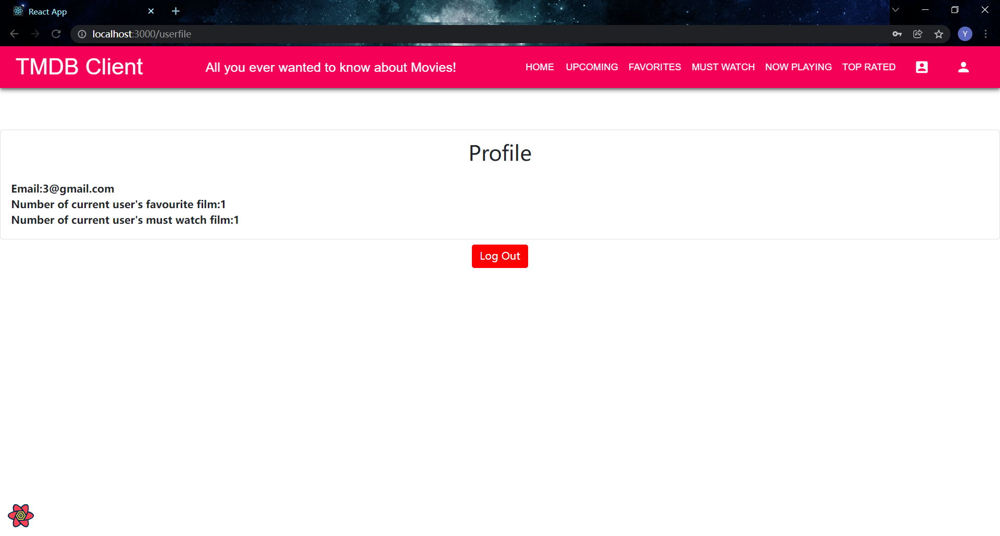

6.Film actors

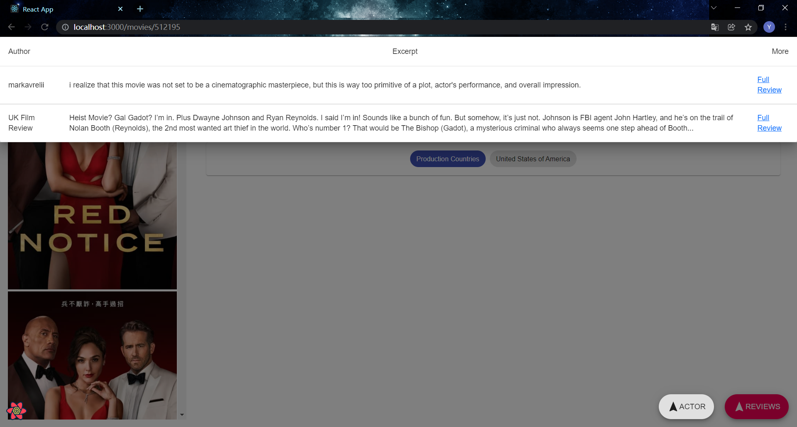
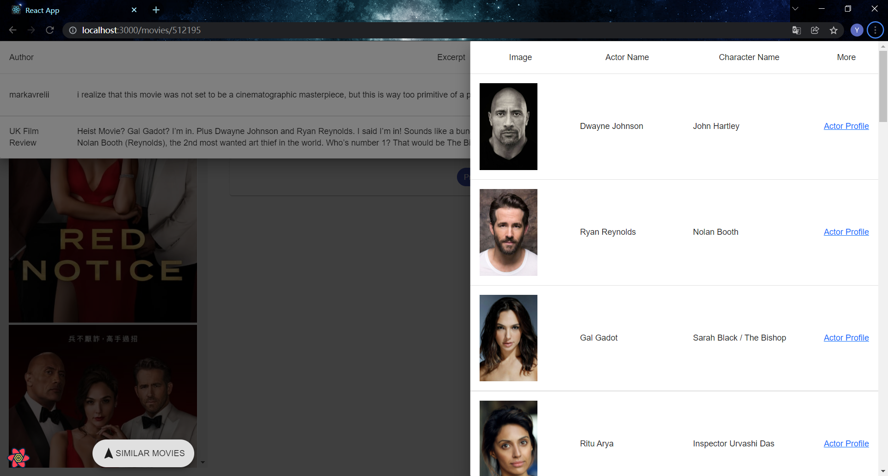

>After clicking the fab button of review, continue to click the ACTOR button in the lower right corner to see the movie actor's drawer. Click "Acter Profile" to view the detailed information of the actor.

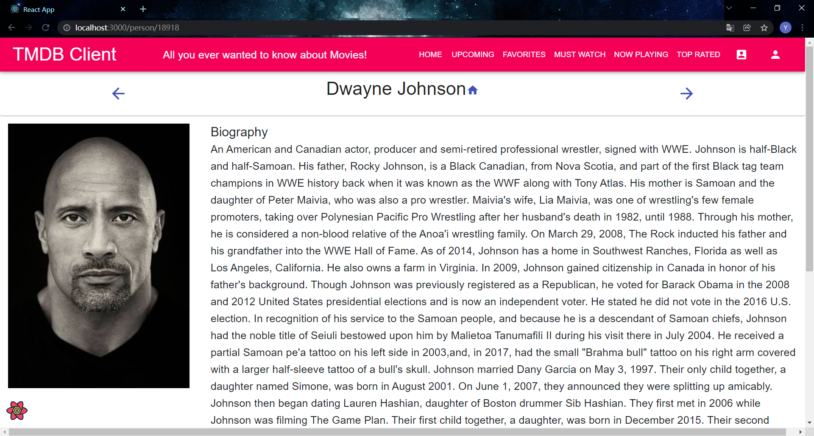

6.Similar movies

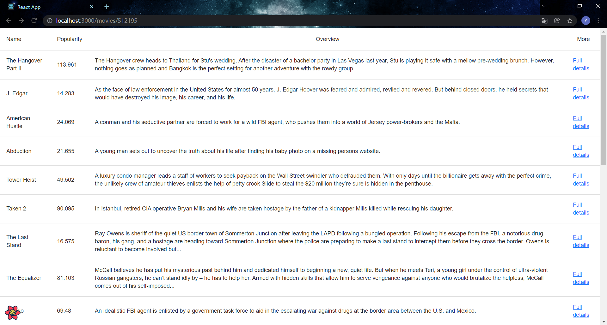

>After the drawer of the movie actor appears, continue to click the button of similar movies in the lower corner to see similar movies of the movie. Click "Full details" to view the detailed information of the similar movie.

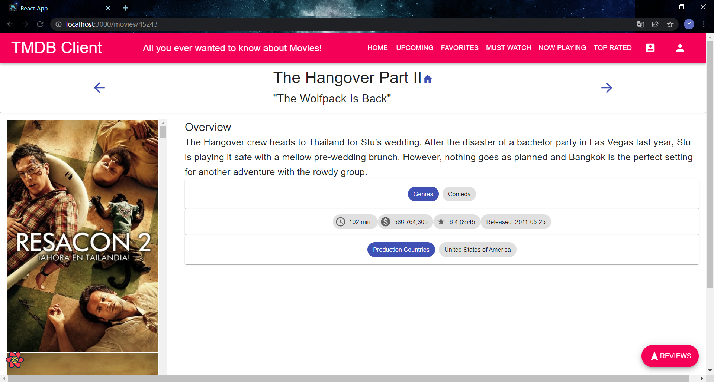

### Routing.

+ /person/:id - Show actor details.
+ /movies/top-rated - displays top rated movies.
+ /movies/now-playing - displays now playing movies.
+ /login - login interface.
+ /signup - signup interface
+ /userfile - user's profilel(require authentication)

## Independent learning (If relevant).

1.firebase authentication

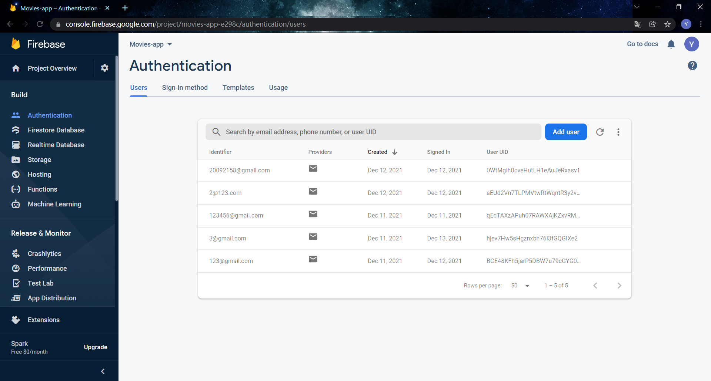

REFERENCE:https://firebase.google.com/docs/auth?authuser=0
https://www.youtube.com/watch?v=9zdvmgGsww0&list=PL4cUxeGkcC9jERUGvbudErNCeSZHWUVlb

